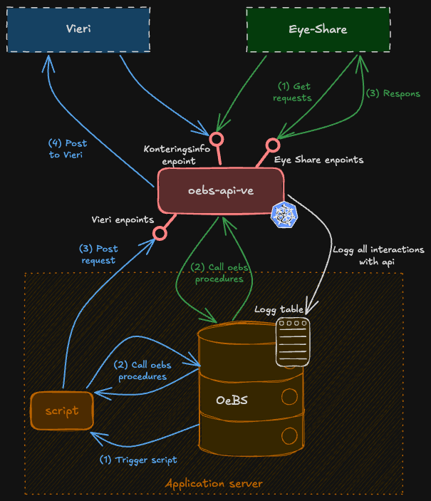

# oebs-api-ve

REST API service that integrates OEBS (Oracle E-Business Suite) with Eye-Share and Vieri. The service exposes PL/SQL stored procedures from OEBS as REST endpoints, enabling querying and pushing data related to invoices, purchase orders, accounting entries, and supplier information.
OEBS uses the API to post data to Vieri, and Eye-Share uses it to fetch data from OEBS.

---

## Architecture

The service acts as a middleware between the external systems Eye-Share and Vieri and the OEBS Oracle database.
Vieri receives data from OEBS via POST endpoints, requested by a script on the application server triggered daily by OeBS. 
Eye-Share both fetches data from OEBS via GET endpoints and posts data to OEBS via POST endpoints. Both services uses the
same _konteringsinfo_ endpoint for validating account strings.
---

## Functionality

### Instances and OEBS environments
The service currently runs with four instances in the secure zone: u1, t1, q1, and prod. External services do not have direct access to the ingress.
To allow Vieri and Eye-Share to reach the service, firewall rules have been opened from the secure zone (fss) to external users — but only for the u1, q1, and prod ingresses.
The t1 instance is therefore only accessible from within the secure zone.

To allow consumers to use oebst1 rather than oebsu1, **the t1 instance exposes data from oebsu1, while u1 exposes data from oebst1**.
As a result, t1 is the preferred environment for development and testing, and is also the first to be deployed in the pipeline. Deployment order: **t1 → u1 → q1 → prod**.

This setup deviates from the standard and should be corrected as soon as possible. The URLs cannot be changed since firewall rules reference the u1 URL specifically. However, the instance names should be updated to align with other services.

### Data flow
The data flow through the endpoints can be divided into three main flows. All requests and responses are logged to the OEBS database table `XXRTV_RESTAPI_LOGG`, including correlation ID, timestamps, duration, and status codes.

#### Eye-Share flow
Eye-Share makes GET requests to oebs-api-ve to fetch data from OEBS. Requests include query parameters that are mapped to PL/SQL procedure inputs, which are then called via JDBC. Results are returned as JSON to Eye-Share.
There is also a POST endpoint that Eye-Share uses to send accounting information to OEBS.

#### Vieri flow
Once a day, a job in OEBS triggers data transfers to Vieri. The transfer is initiated via a [script](https://github.com/navikt/oebs/blob/main/bin/XXRTVVIERIAPI.prog) triggered by OEBS but running on the application server. The script fetches data from OEBS and posts it to Vieri via POST endpoints exposed by this service. Vieri does not consume anything from the API — it only receives data that is posted to it.

#### Shared account string validation
Both Eye-Share and Vieri use the same account string validation, implemented in this API. This ensures that both systems validate the account string consistently to guarantee data correctness and format.

### OEBS PL/SQL procedures
Installation of the packages and log tables in OEBS used by this repository is handled by an [install script](https://github.com/navikt/oebs/blob/main/install/install_IFA_restapi_ve_v1.sh) in the OEBS repository.

The [package specification](https://github.com/navikt/oebs/blob/main/admin/sql/xxrtv_oebs-restapi-ve-v1.pks) and [package body](https://github.com/navikt/oebs/blob/main/admin/sql/xxrtv_oebs-restapi-ve-v1.pkb) are also in the OEBS repository.
The package specification contains the methods called by the services in this repository, and the package body contains their implementations.

---

## Dependencies

| System | Purpose |
|--------|---------|
| **OEBS Oracle Database** | Source of all business data; accessed via PL/SQL stored procedures |
| **Vieri REST API** | Target for dimension, account, and supplier data forwarded from OEBS |
| **Eye-Share** | Consumer of invoice/document APIs |
| **NAV Token Validation** | OAuth2/JWT security via Azure AD |
| **NAIS platform** | Container orchestration, secrets management, and deployment |

---

## Running Locally

To run the service locally, use the `local` profile and set the following environment variables. Values for all secrets can be retrieved from the NAIS console for the application `oebs-api-ve-t1`:

- `OEBS_USERNAME` – username for OEBS
- `OEBS_PASSWORD` – password for OEBS
- `OEBS_URL` – URL for OEBS
- `AZURE_APP_WELL_KNOWN_URL` – discovery URL for the Azure AD app

You must also have connectivity to oebsu1, which is located in the secure zone.
You can either use **vdi-utvikler-oebs** (a VDI set up for development in the secure zone) or the **Global Secure Access Client**.
For more information, see the [oksty developer documentation](https://github.com/navikt/oksty-documentation).

Note that when running locally, the service connects to **oebsu1**, even though credentials are fetched from the `oebs-api-ve-t1` instance.
For more information about the different instances, see [Instances and OEBS environments](#instances-and-oebs-environments) under Functionality.

[Swagger UI](http://localhost:8080/swagger-ui/index.html) is available when running locally,
but all endpoints are protected by Entra ID by default. To test endpoints without authentication,
replace the `@Protected` annotation in a controller with `@Unprotected`.

---

## Testing

Unit tests are set up using JUnit and Mockito. No integration tests are currently configured.

---

## Monitoring and Alerting

No alerting is currently configured. Issues must be detected by users experiencing errors when calling the API, or through observed problems in OEBS that can be traced back to the API.

Standard application monitoring is available via Grafana dashboards:
- [Grafana dashboard for u1](https://grafana.nav.cloud.nais.io/a/nais-apm-app/services/team-oebs/oebs-api-ve-u1?namespace=team-oebs&environment=dev-fss)
- [Grafana dashboard for t1](https://grafana.nav.cloud.nais.io/a/nais-apm-app/services/team-oebs/oebs-api-ve-t1?namespace=team-oebs&environment=dev-fss)
- [Grafana dashboard for q1](https://grafana.nav.cloud.nais.io/a/nais-apm-app/services/team-oebs/oebs-api-ve-q1?namespace=team-oebs&environment=dev-fss)
- [Grafana dashboard for prod](https://grafana.nav.cloud.nais.io/a/nais-apm-app/services/team-oebs/oebs-api-ve?namespace=team-oebs&environment=prod-fss)
---

## Deploy

### Branching strategy
- Feature development should happen on dedicated branches with a PR to `main`.
- Merging to `main` triggers deployment to **all environments** (T1, U1, Q1, and production).

### Referencing Jira tasks
Include the Jira task key in the branch name and/or commit message. All PRs are squash-merged into main, so the most important thing is that the Jira issue is referenced in the squash commit message and that the PR title references the Jira issue.
For example, if working on `OEBS-123`, the commit message should include `feat(OEBS-123): new rest endpoint` and the PR title should follow the same format.
If a PR covers multiple Jira issues, all should be referenced, e.g. `feat(OEBS-123, OEBS-124): new rest endpoint and tests`.
All individual commits should be listed in the PR description.

### Deployment pipeline
Deployments are handled by GitHub Actions (`.github/workflows/build-deploy-oebs-api-ve.yaml`).

### Promotion criteria
Before deploying to production:
- All tests must pass (`mvn verify`).
- SonarCloud analysis must not introduce new critical issues.

---

## Documentation

### Swagger / OpenAPI
Swagger UI is available when the application is running:

- [Swagger u1](https://oebs-api-ve-u1.dev.intern.nav.no/swagger-ui/index.html#/)
- [Swagger t1](https://oebs-api-ve-t1.dev.intern.nav.no/swagger-ui/index.html#/)
- [Swagger q1](https://oebs-api-ve-q1.dev.intern.nav.no/swagger-ui/index.html#/)
- [Swagger prod](https://oebs-api-ve.intern.nav.no/swagger-ui/index.html#/)

### Confluence
- [Confluence documentation](https://confluence.adeo.no/spaces/ITO/pages/505514658/OEBS+API+-+Innkj%C3%B8p+og+Faktura+NAIS)
  (Restricted access)

---
